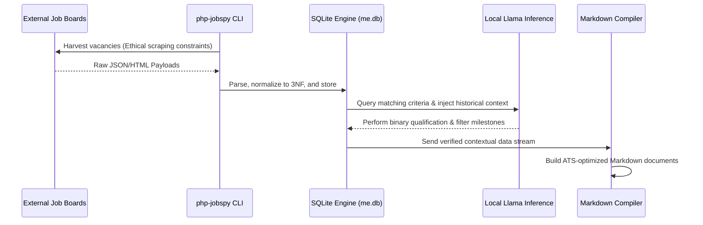
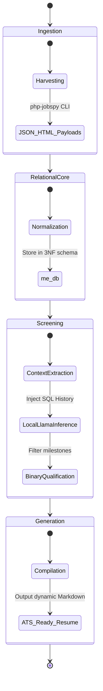

# System Visual Architecture & Roadmap

## Visual Architecture

### Sequence Diagram

### State Diagram

## Production Roadmap

*   **Phase 1: SQLite 3NF Database Schema Generation and Table Initialization (`database/me.db`)**
    Establish the absolute core relational engine to guarantee data integrity, eliminate redundancy, and initialize the foundational schema for all downstream AI processing.

*   **Phase 2: Master Ledger Markdown-to-Relational Data Extraction and Seeding via Local Llama**
    Convert the historical, flat file Markdown records into normalized relational records within the SQLite database, utilizing the local Llama model to intelligently parse and seed the master ledger.

*   **Phase 3: Ethical Scraping Loop Ingestion and Binary Qualification Matching Engine**
    Deploy the `php-jobspy` harvesting utility under strict ethical constraints (robots.txt, sleep intervals) to pull external vacancy data, feeding it through the binary qualification screening engine via local Llama.

*   **Phase 4: Dynamic ATS-Optimized Markdown Resume and Portfolio JSON Builders**
    Engineer the final output compilation utilities that take contextualized telemetry from the local DB and automatically construct perfectly targeted, raw text Markdown resumes and JSON portfolio data.

*   **Phase 5: Outbound Matrix Integration**
    Engineering automated API connectors to programmatically push profile, summary, and experience updates directly to LinkedIn and other platform endpoints to maintain a verified, honest single source of truth across all public spaces.
